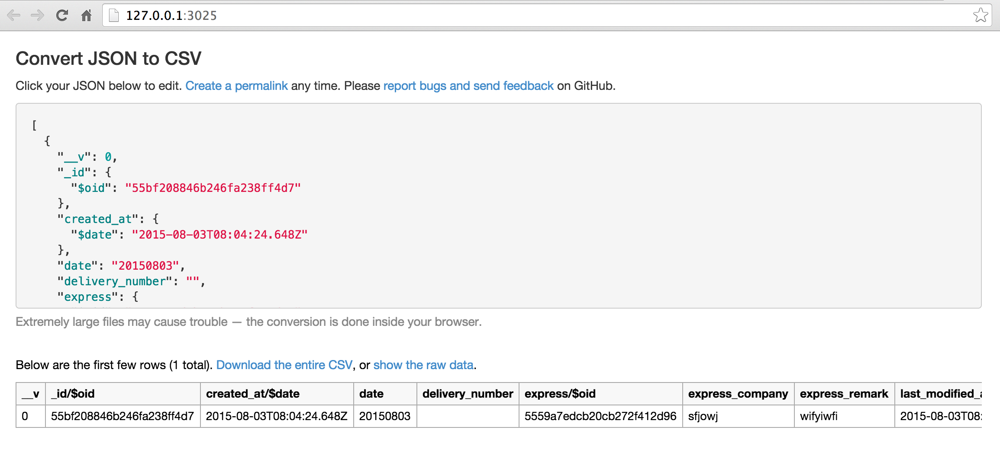

# mongodb备份和导出csv

 mongodb备份方式有三种
 
 -  文件快照方式 
 - 复制数据文件方式 
 - 使用mongodump方式

oplog以及副本集，集群等备份，还是推荐用mongodump

## 原理

mongodb的简单备份一般使用mongoexport即可，只要你装了mongodb就有的命令，上面说的其他方式适合dba，而非程序员

基本用法

    mongoexport -d xxx-db -c activities -o activities.csv

说明

- -d 指明数据库是哪个
- -c 说明collection名字
- -o 是输出的文件名称

其实还有`jsonArray`,`query`等其他高级用法，尽在

    mongoexport --help

帮助文档里。

## 全库备份

之前的做法是写一个shell脚本，把上面的每一个collection拷贝一行，然后crontab定时去执行

如果collection太多呢？真是又臭又长。。。

如果再加个日志，如果再xxx

那感觉才叫一个刺激。。。

以上是我写mmb的动机

现在说说我的解决方案，即mmb

## mmb是神马？

mmb是moa mongodb backup，很直白的说它是备份mongodb数据的。

readme里我是这样写的

```
mmb = moa mongodb backup, backup data to a dirname that generated by momentjs's date format
```

它可以根据配置项里的dirname选项，按照时间去生成目录，也就是说我想按照天去备份，就写成

    "dirname":"YYYY-MM-DD"
  
我想按照秒备份

    "dirname":"YYYY-MM-DD HH:mm:ss"

### 特性

- 支持linux和mac（严格的说，支持shell的都可以）
- 纯nodejs写的模块，提供cli，可以简单实用
- 支持配置文件
- 支持多个实例
- 支持crontab，使用简单

### Install

    [sudo] npm install -g mmb
    
### Usages

第一步初始化一个配置文件，执行

    mmb init

此时，用任何编辑器打开`mongo.config.json`，按需要修改里面的配置文件即可，然后就可以备份数据了：
    
    mmb

会读取当前目录下的`mongo.config.json`文件，根据文件内的配置信息，备份全部数据到指定目录。

### 配置文件说明

当执行 `mmb init`, 会创建mongo.config.json文件，它就是mmb的配置文件

mongodb服务器配置项

- "host": 127.0.0.1
- "port": 27017
- "db": database name

备份数据目录名称配置项

- "dirname": dirname that generated by momentjs's date format,  see http://momentjs.com/docs/#/parsing/string-format/

说明：    

    "dirname":"YYYY-MM-DD HH:mm:ss"

这样的format里有空格无法生成目录名，所以空格会替换为`_`


### 与crontab集成：以每分钟为例

如果不了解crontab，请移步https://www.baidu.com/s?wd=crontab&rsv_spt=1&issp=1&f=8&rsv_bp=0&rsv_idx=2&ie=utf-8&tn=baiduhome_pg&rsv_enter=1&rsv_sug3=3&rsv_sug1=3

第一步：初始化

    mmb init
    
第二步：修改配置文件，假定我的mongodb信息不变，我需要修改dirname，按分钟生成,具体如下：

```
{
  "host": "127.0.0.1",
  "port": "27017",
  "db": "xbm-wechat-api",
  "dirname":"YYYY-MM-DD HH:mm"
}
```

第三步：测试

    mmb

看看，生成的目录是否正常，以及目录里的数据是否正常

```
➜  mongodbbackup  date
Sun Aug 23 22:42:14 CST 2015
➜  mongodbbackup  mmb  
➜  mongodbbackup  ls
2015-08-23_22:42     2015-08-23_22:42.log export.sh            mongo.config.json
```

这样就代表是正确的。

第四步：集成crontab，写一个脚本cron.sh

```
➜  mongodbbackup  cat cron.sh 
 #！/bin/bash

cd /Users/sang/test/mongodbbackup
mmb
```

然后,给cron.sh增加执行权限

```
chmod +x cron.sh 
```

配置crontab，定时执行cron.sh

```
➜  mongodbbackup  touch cron-mmb.conf
```

填写以下内容

```
* * * * * sh /Users/sang/test/mongodbbackup/cron.sh
```

保存即可。

```
➜  mongodbbackup  sudo crontab -u root cron-mmb.conf 
```

这样每分钟都会执行cron.sh，即每分钟备份一次了

五个星星表示

- minute — 分钟，从 0 到 59 之间的任何整数 
- hour — 小时，从 0 到 23 之间的任何整数 
- day — 日期，从 1 到 31 之间的任何整数（如果指定了月份，必须是该月份的有效日期） 
- month — 月份，从 1 到 12 之间的任何整数（或使用月份的英文简写如 jan、feb 等等） 
- dayofweek — 星期，从 0 到 7 之间的任何整数，这里的 0 或 7 代表星期日（或使用星期的英文简写如 sun、mon 等等）

crontab简单用法说明

- crontab -l显示目前所有的任务
- crontab -r删除所有的任务
- crontab -e编辑任务

## 导出csv

照理说mongoexport是支持导出csv，但是那个东西基本不能看，不是人读的


那么有没有更好一点的做法呢？

### 以jsonArray导出

    ➜  mongodbbackup  mongoexport -d xbm-wechat-api -c senddeliveryhistories -o senddeliveryhistories.json  --jsonArray --query "{'user_to_name' : 'ywiwfi'}"
    2015-08-23T23:12:45.668+0800	connected to: localhost
    2015-08-23T23:12:45.670+0800	exported 1 record
    ➜  mongodbbackup  cat senddeliveryhistories.json 
    [{"__v":0,"_id":{"$oid":"55bf208846b246fa238ff4d7"},"created_at":{"$date":"2015-08-03T08:04:24.648Z"},"date":"20150803","delivery_number":"","express":{"$oid":"5559a7edcb20cb272f412d96"},"express_company":"sfjowj","express_remark":"wifyiwfi","items":[],"last_modified_at":{"$date":"2015-08-03T08:04:24.648Z"},"last_modified_user":"","remark":"jjjj","status":2,"user_from_address":"kjwiji","user_from_id":{"$oid":"5559944fa56f3f192e22d2d4"},"user_from_mobile":"ijfij","user_from_name":"lwlfl","user_to_address":"uwyfuwi","user_to_id":{"$oid":"555993e7c3ab570c2eb23687"},"user_to_mobile":"uyfowhohi","user_to_name":"ywiwfi"}]

### 启动j2csv

把拷贝json文件里的内容，放到文本框里

    ➜  mongodbbackup  j2csv




## more

如果你有更好的办法请不吝赐教 shiren1118@126.com

- https://github.com/moajs/mmb
- https://github.com/i5ting/json2csv

全文完

欢迎关注我的公众号【node全栈】

